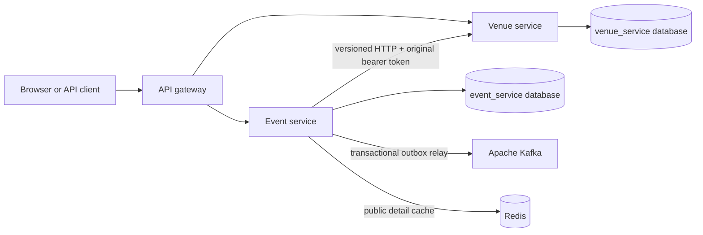
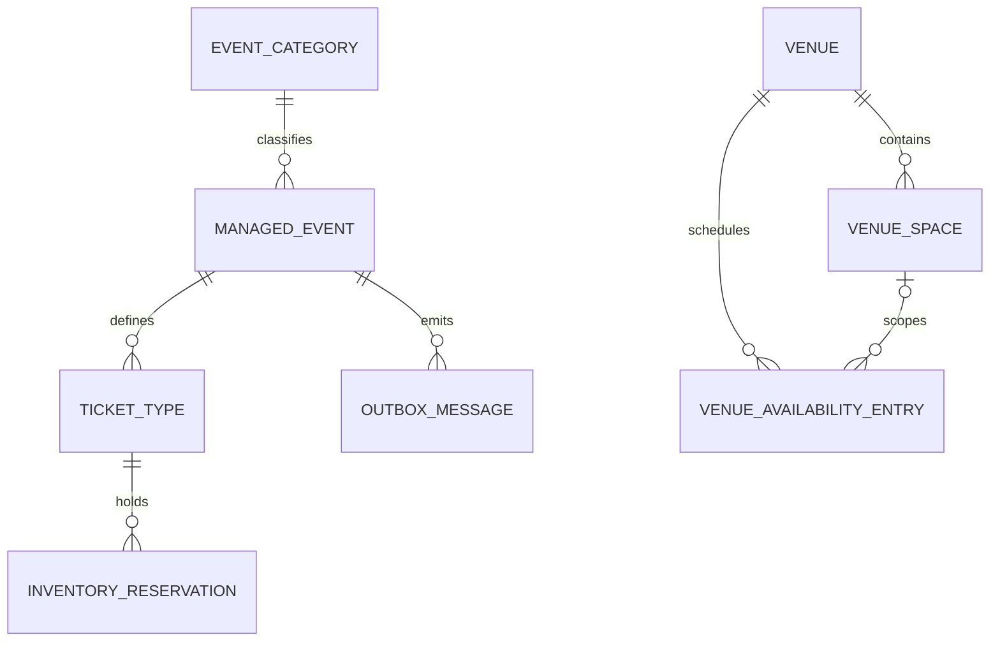
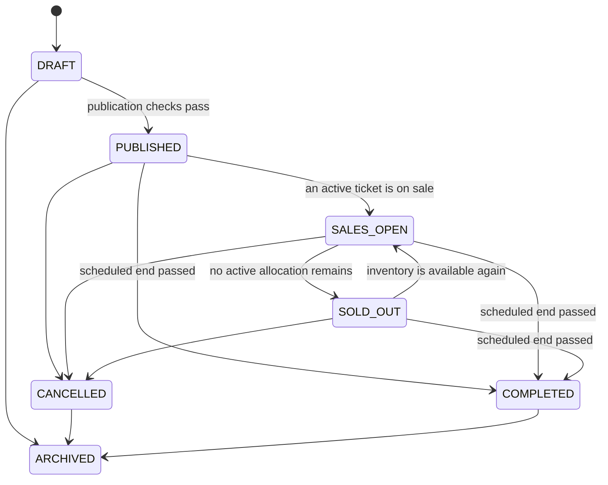

# Phase 3 event, venue, and ticket-inventory architecture

## Scope and ownership

Phase 3 implements venue management, event lifecycle, public event discovery, ticket-product definitions, and temporary ticket-inventory holds. It does not create bookings, payments, attendee-owned or issued tickets, refunds, or a payment Saga.



The event database stores venue and room UUIDs only. It has no venue tables, JPA relationships, or direct venue queries. Event publication calls the venue API to validate capacity and acquire an availability reservation. In Phase 3 an organizer can assign only a venue they own; `ADMIN` can operate across ownership boundaries.

## Domain model



`TicketType` is an event-owned sellable product and inventory definition. `InventoryReservation` is a short-lived event-owned hold used by the future attendee-service contract. Neither is an attendee-owned issued ticket.

## Event lifecycle



Full schedule, venue, category, and capacity edits are restricted to `DRAFT`. Ticket definitions remain mutable through `PUBLISHED`, then lock when sales open. Cancellation releases the venue assignment before committing the event transition. Completed reservations naturally stop conflicting after their scheduled end.

Publication requires all of the following:

- a future, ordered schedule and valid IANA timezone;
- an active category;
- a venue and optional room accepted by the venue-service API;
- event capacity no greater than the selected venue or room capacity;
- no conflicting whole-venue, room, or manual availability block;
- at least one active ticket type;
- combined active ticket allocation no greater than event capacity;
- valid ticket sales windows ending no later than event start.

## Venue availability

Venue availability entries are either `BLOCK` or `EVENT_RESERVATION`. A whole-venue entry conflicts with every overlapping room entry. A room entry conflicts with a whole-venue entry or another entry for the same room, but independent rooms may host simultaneous events.

Every availability mutation first locks the owning venue row. This serializes competing whole-venue and room decisions. The event owner reference (`event:<eventId>`) is unique and idempotent; an exact replay returns the original reservation, while reuse for different input returns `409`. Venue and room capacities cannot be reduced below an active future event assignment.

Address and coordinate enrichment enters through `LocationEnrichmentPort`. The local adapter preserves validated caller input and performs no external network call. A future maps provider adapter can replace it without introducing provider SDK types into the venue domain.

## Ticket inventory protocol

The future attendee service can call these authenticated endpoints while forwarding the end-user bearer token:

| Method | Path | Purpose |
| --- | --- | --- |
| `GET` | `/api/v1/events/{eventId}/ticket-types/{ticketTypeId}/inventory` | Check current allocation and availability |
| `POST` | `/api/v1/events/{eventId}/ticket-types/{ticketTypeId}/inventory/reservations` | Create an expiring hold |
| `POST` | `/api/v1/events/{eventId}/ticket-types/{ticketTypeId}/inventory/reservations/{reservationId}/release` | Release a hold |

Both mutations require a globally unique `Idempotency-Key` with 1-128 safe identifier characters. Reserve keys are bound to requester, event, ticket type, and quantity. Replaying the same input returns the original reservation; reuse by another caller or with different input returns `409 IDEMPOTENCY_KEY_REUSED`.

Reservations lock the ticket-type row, expire old holds, validate the sales window and min/max quantity, then update the reserved count and hold in one local transaction. Concurrent requests therefore cannot exceed allocation. Holds expire after 15 minutes by default; read/write operations and the scheduled expiry worker return their quantity. Release is convergent and idempotent. No payment authorization or issued-ticket creation occurs.

## Public discovery and caching

Anonymous clients may read only:

- `GET /api/v1/events` with `categoryId`, `startsAfter`, `startsBefore`, `status`, `search`, `page`, and `size`;
- `GET /api/v1/events/{eventId}` for public lifecycle states;
- `GET /api/v1/event-categories`.

`DRAFT` and `ARCHIVED` never appear through public APIs. `CANCELLED` remains visible so clients can observe cancellation. Public detail responses are cached in Redis for five minutes by default and are evicted on event transitions, category edits, ticket definition changes, inventory reserve/release, and hold expiry. PostgreSQL remains authoritative.

## Reliable lifecycle events

Event and ticket changes write an event-service-owned outbox row in the same transaction. The relay publishes to `event-platform.event-lifecycle.v1` and marks rows published only after Kafka acknowledges them. A crash between acknowledgement and the database mark can duplicate a message, so consumers must deduplicate by the `eventId` Kafka header.

Version 1 contracts are:

- `event-platform.event.published.v1`;
- `event-platform.event.updated.v1`;
- `event-platform.event.cancelled.v1`;
- `event-platform.ticket-type.changed.v1`.

Headers follow the platform convention: `eventId`, `eventType`, `eventVersion`, `occurredAt`, `producer`, `correlationId`, and optional `traceparent`. No application transaction writes Kafka directly.

## Example requests

Create a category as `ADMIN`, then a venue and event as `ORGANIZER`:

```http
POST /api/v1/event-categories
Authorization: Bearer <admin-token>
Content-Type: application/json

{"slug":"technology","name":"Technology","description":"Technology events"}
```

```http
POST /api/v1/venues
Authorization: Bearer <organizer-token>
Content-Type: application/json

{
  "name":"Cairo Convention Centre",
  "description":"Main conference venue",
  "address":{"addressLine1":"1 Nile Street","city":"Cairo","countryCode":"EG"},
  "timezone":"Africa/Cairo",
  "totalCapacity":1200,
  "amenities":["wifi","parking"],
  "metadata":{"accessibility":"step-free"}
}
```

```http
POST /api/v1/events
Authorization: Bearer <organizer-token>
Content-Type: application/json

{
  "title":"Cairo Technology Summit",
  "description":"A full-day technology conference",
  "categoryId":"<category-uuid>",
  "timezone":"Africa/Cairo",
  "startsAt":"2026-10-20T07:00:00Z",
  "endsAt":"2026-10-20T16:00:00Z",
  "venueId":"<venue-uuid>",
  "venueSpaceId":null,
  "capacity":800
}
```

Add a ticket type, then publish:

```http
POST /api/v1/events/<event-uuid>/ticket-types
Authorization: Bearer <organizer-token>
Content-Type: application/json

{
  "name":"General admission",
  "description":"Conference access",
  "price":40.00,
  "currency":"USD",
  "allocation":800,
  "salesStart":"2026-08-20T00:00:00Z",
  "salesEnd":"2026-10-20T06:00:00Z",
  "minQuantity":1,
  "maxQuantity":5,
  "status":"ACTIVE"
}
```

```http
POST /api/v1/events/<event-uuid>/transitions
Authorization: Bearer <organizer-token>
Content-Type: application/json

{"targetStatus":"PUBLISHED"}
```

Reserve inventory without creating a booking or issued ticket:

```http
POST /api/v1/events/<event-uuid>/ticket-types/<ticket-type-uuid>/inventory/reservations
Authorization: Bearer <attendee-token>
Idempotency-Key: booking-attempt-018f
Content-Type: application/json

{"quantity":2}
```
