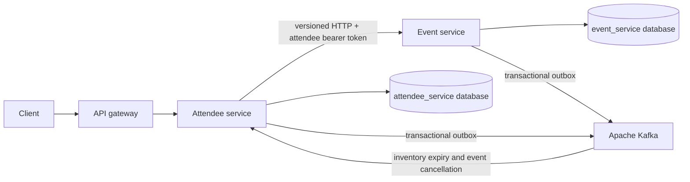
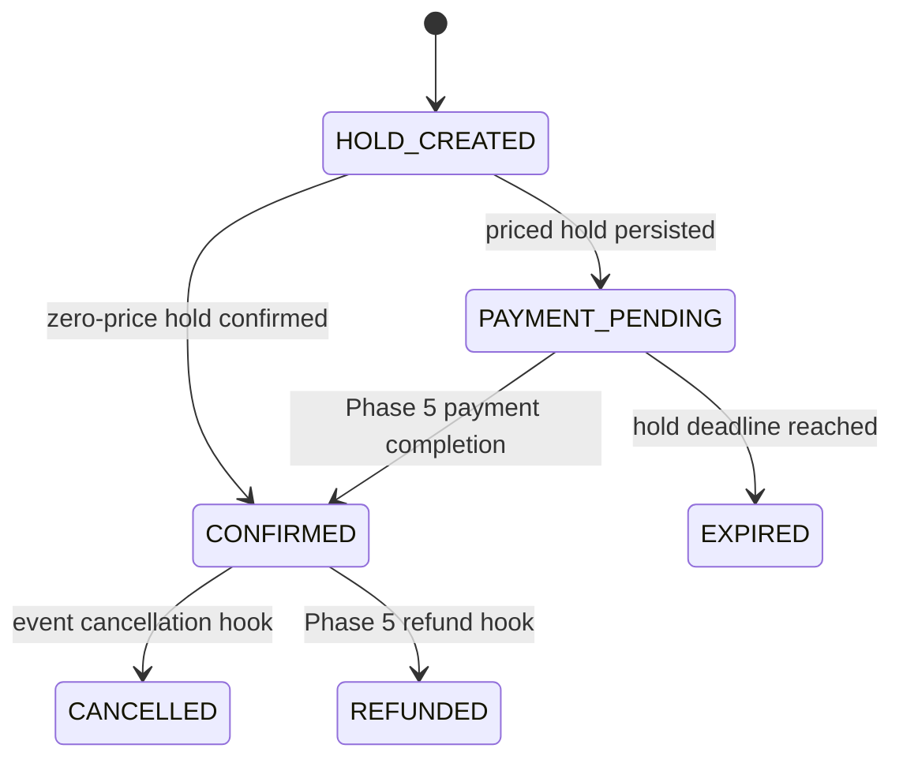

# Phase 4 attendee booking, ticketing, and check-in architecture

## Scope and ownership

Phase 4 implements attendee profiles, event registrations, inventory-backed bookings, expiring ticket holds, signed QR tickets, ticket history, validation, and check-in. Payment integration and refunds remain Phase 5 work. Priced bookings stop in `PAYMENT_PENDING`; a zero-price booking is confirmed without a payment provider and is the only Phase 4 path that issues tickets.

Attendee-service owns `AttendeeProfile`, `Registration`, `Booking`, `BookingLineItem`, `TicketHold`, `Ticket`, `CheckIn`, scan audit, idempotency commands, processed-message IDs, and its outbox. It stores event, organizer, ticket-type, and venue UUIDs plus immutable display snapshots. It has no JPA relationship to, credential for, or query against event-service tables.

Waitlisting is intentionally deferred to the differentiation phase. Adding it now would create an allocation policy before event prioritization, notification, and offer-expiry rules exist.



## Booking and idempotency flow

1. An authenticated `ATTENDEE` sends one event ID, ticket-type ID, quantity, and an `Idempotency-Key`.
2. Attendee-service creates or loads a durable `BookingCommand`, unique by attendee and client key. The command fixes the input, booking ID, and downstream reservation key before the remote call.
3. Attendee-service forwards the original bearer token, correlation ID, trace context, and deterministic reservation key to event-service.
4. Event-service locks the ticket-type row, expires old holds, checks sales and quantity rules, increments reserved inventory, stores the hold, and appends `inventory.held` in one transaction.
5. Attendee-service locks the command and creates its registration, booking, line snapshot, hold projection, and `BookingCreated` outbox record in one local transaction.
6. A priced booking becomes `PAYMENT_PENDING`. A zero-price booking idempotently confirms the event hold, becomes `CONFIRMED`, and issues one ticket per unit.

A crash after the event hold but before attendee commit is recoverable: retrying the same client key reloads the pending command, calls event-service with the same deterministic key, receives the original hold, and finishes the same booking. Reusing the client key with different input returns `409` with API code `IDEMPOTENCY_KEY_REUSED`. Concurrent retries serialize on the booking-command row before finalization.

## Inventory concurrency and expiration

PostgreSQL is the authoritative inventory store. Event-service takes a pessimistic write lock on the ticket-type row before checking or changing `reserved_quantity`; the reservation and count change commit together. The same lock order is used for confirm, release, opportunistic expiry, and the expiry worker. The database constraint prevents the reserved count from exceeding allocation. Redis is not involved, so Redis unavailability cannot cause overselling.

An active event reservation has a server-generated `expiresAt`. Event-service's scheduled worker releases expired inventory and publishes `event-platform.inventory.expired.v1` through its outbox. Attendee-service also moves its process state to `EXPIRED` at the same deadline and consumes the event-service expiry event idempotently, covering either worker being delayed. Confirmed reservations are never expired by the hold worker.



## Signed QR tickets

The QR value is a compact three-segment HMAC-SHA256 token. Its protected header fixes `HS256`, type `ETP-QR`, and contract version 1. Its payload contains only:

- issuer;
- opaque ticket UUID;
- event UUID;
- ticket token version;
- issuance timestamp.

It contains no attendee name, email, phone number, price, or other PII. Validation uses constant-time signature comparison and then checks the persisted ticket/event IDs, token version, ticket status, and expected scan event. Cancellation and refund increment the token version and set an explicit terminal status.

`TICKET_QR_SIGNING_SECRET` is external configuration and must contain at least 32 bytes. Local development may generate an ephemeral key when `TICKET_QR_ALLOW_EPHEMERAL_KEY=true`; tokens then intentionally stop validating after a restart. Persistent environments must inject a private secret and disable ephemeral fallback.

## Validation, check-in, and audit

`EVENT_STAFF`, `ORGANIZER`, and `ADMIN` can call validation and check-in. An organizer is restricted to tickets whose event organizer snapshot matches their user ID. Phase 4 has no staff-assignment domain, so an account deliberately granted `EVENT_STAFF` may scan any event; per-event staff assignments can narrow that role in a later operations phase.

Validation does not mutate the ticket. Check-in pessimistically locks the ticket row. An `ISSUED` ticket creates one unique `CheckIn`, changes to `CHECKED_IN`, records the scan attempt, and appends `TicketCheckedIn` in one transaction. A concurrent or later scan returns `ALREADY_CHECKED_IN` with the original safe timestamp. Invalid format/signature, unknown ticket, wrong event, wrong organizer, cancelled, refunded, and non-issued states are rejected with an explicit outcome.

Every authorized validation/check-in attempt stores the scanner UUID, expected event, optional ticket UUID, operation, outcome, token SHA-256 fingerprint, idempotency key, and safe timestamps. The raw QR token and attendee PII are never written to the audit table.

## APIs

| Method | Path | Access | Purpose |
| --- | --- | --- | --- |
| `GET`, `PUT` | `/api/v1/attendees/me` | `ATTENDEE` | Read or update the owned profile |
| `POST` | `/api/v1/bookings` | `ATTENDEE` | Idempotently create a booking and hold |
| `GET` | `/api/v1/bookings` | `ATTENDEE` | Read owned booking history |
| `GET` | `/api/v1/bookings/{bookingId}` | Booking owner | Read one owned booking |
| `GET` | `/api/v1/attendees/me/tickets` | `ATTENDEE` | Read upcoming or all owned tickets |
| `POST` | `/api/v1/tickets/validate` | Staff/organizer/admin | Validate a signed QR token |
| `POST` | `/api/v1/check-ins` | Staff/organizer/admin | Check in an issued ticket exactly once |
| `POST` | `/api/v1/events/{eventId}/ticket-types/{ticketTypeId}/inventory/reservations/{reservationId}/confirm` | Reservation owner/admin | Confirm an event-service hold |

All POST operations above require `Idempotency-Key`. Booking/ticket history is selected by the authenticated JWT subject; no attendee ID from a request parameter controls ownership.

## Integration events

Business-critical publications use a local transactional outbox. Attendee-service publishes to `event-platform.attendee-lifecycle.v1`:

- `event-platform.booking.created.v1`;
- `event-platform.ticket-hold.expired.v1`;
- `event-platform.ticket.issued.v1`;
- `event-platform.ticket.checked-in.v1`.

Event-service adds `inventory.held`, `inventory.confirmed`, `inventory.released`, and `inventory.expired` version 1 events to its existing lifecycle topic. Headers use canonical `messageId`, `eventType`, `schemaVersion`, occurrence/correlation/trace metadata, producer, and aggregate identity while retaining Phase 5 aliases during rolling upgrades. Attendee-service records processed message IDs atomically with state changes because delivery is at least once.

## Example

```http
POST /api/v1/bookings
Authorization: Bearer <attendee-token>
Idempotency-Key: checkout-2026-08-16-001
Content-Type: application/json

{
  "eventId": "<event-uuid>",
  "ticketTypeId": "<ticket-type-uuid>",
  "quantity": 2
}
```

A priced result returns `PAYMENT_PENDING`, the server hold expiry, immutable event/ticket snapshots, and no ticket. Retry the exact request with the exact key after a timeout. Do not mint a new key until the user intentionally starts a new booking attempt.
