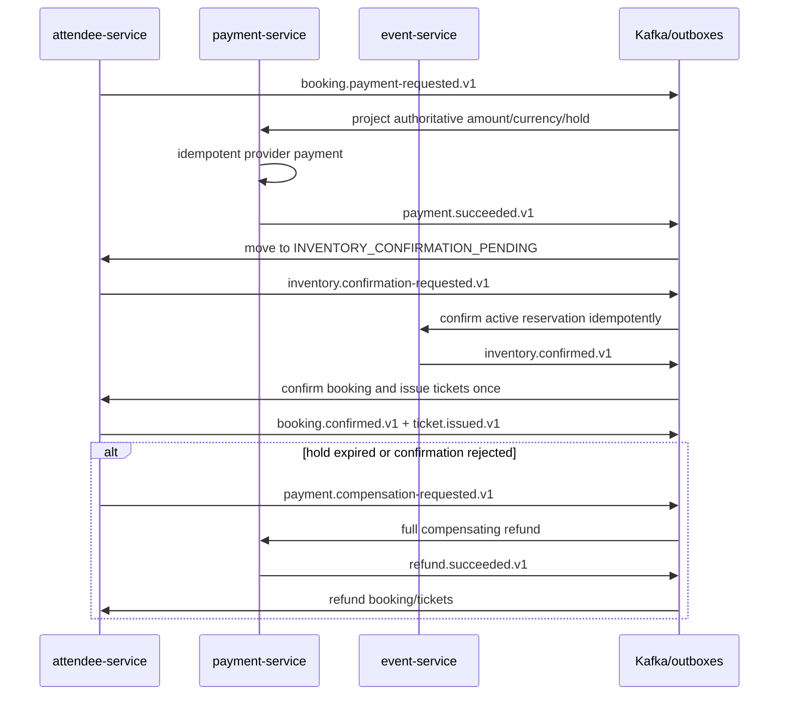

# Phase 5 payment, refund, and booking Saga

## Ownership and trust boundaries

- `payment-service` owns payment orders projected from booking events, payments, attempts, immutable transactions, refunds, webhook deduplication, ticket projections, and its outbox.
- `attendee-service` owns the `BookingSaga`, booking/registration state, ticket-hold projection, issued tickets, token invalidation, and orchestration commands.
- `event-service` remains authoritative for reservation expiry, confirmation, release, and ticket allocation counters.
- Services exchange scalar identifiers and immutable snapshots only. They have no cross-service JPA relationship or database query.
- Provider webhooks are accepted only after adapter signature verification. Browser callbacks never settle a payment.

## Happy path and compensation

No arrow spans a database transaction. A local state change and its outgoing message are committed through that service's transactional outbox. Kafka is at least once; `eventId` deduplication plus stable `commandKey` and API `Idempotency-Key` provide exactly-once business effects.

## State machines

Booking Saga states are `PAYMENT_PENDING`, `PAYMENT_PROCESSING`, `INVENTORY_CONFIRMATION_PENDING`, `CONFIRMED`, `PAYMENT_FAILED`, `COMPENSATION_PENDING`, `PARTIALLY_REFUNDED`, `REFUNDED`, `EXPIRED`, and `CANCELLED`. The booking response exposes the current Saga state, payment ID, failure, recovery count, and next action time.

Payment states are monotonic: `CREATED -> PROCESSING -> SUCCEEDED -> PARTIALLY_REFUNDED -> REFUNDED`, or `CREATED/PROCESSING -> FAILED`. A late provider failure cannot replace a settled state. Payment attempts and transactions preserve the detailed history without storing payment method tokens.

## Public payment API

| Method | Path | Policy |
| --- | --- | --- |
| `POST` | `/api/v1/payments` | Booking owner, `Idempotency-Key`; amount/currency come from the booking event projection |
| `GET` | `/api/v1/payments` | Attendee-owned payments |
| `GET` | `/api/v1/payments/{id}` | Owner, owning organizer, or admin |
| `GET` | `/api/v1/payments/{id}/transactions` | Same read policy |
| `POST` | `/api/v1/payments/{id}/verify` | Authorized explicit provider reconciliation |
| `POST` | `/api/v1/payments/{id}/refunds` | Idempotent policy-controlled full/partial refund |
| `POST` | `/api/v1/payments/webhooks/{provider}` | Public transport endpoint, but provider-signature authenticated |

The fake adapter accepts `sandbox-success`, `sandbox-success-refund-fail-once`, `sandbox-failure`, `sandbox-processing`, `sandbox-processing-then-success`, and `sandbox-processing-then-failure`. The refund-failure token settles payment but fails the first refund provider call so a new-key retry can be tested. These opaque tokens are local test fixtures, not card data.

## Refund and inventory policy

- Before the event starts, the attendee can refund the full remaining booking. The owning organizer or an admin can choose active ticket IDs for a partial refund.
- Checked-in, already refunded, foreign, or unknown tickets are rejected. Reusing an idempotency key returns the original refund; different input is rejected.
- Successful refund events invalidate affected tickets by changing status and incrementing their signed QR token version. Check-in rejects both old and newly queried tokens.
- Phase 5 does not return confirmed refunded capacity to resale. This conservative rule avoids reselling a checked-in or provider-disputed seat. Failed/expired unconfirmed holds are released normally.

## Integration events

All records use version 1, UUID `eventId`, `eventType`, `occurredAt`, `producer`, correlation ID, and optional W3C `traceparent` headers.

| Topic | Important event types |
| --- | --- |
| `event-platform.attendee-lifecycle.v1` | `booking.payment-requested`, inventory confirmation/release commands, payment compensation command, booking confirmed/failed/refunded, ticket issued/checked-in |
| `event-platform.payment-lifecycle.v1` | payment processing/succeeded/failed and refund succeeded/failed |
| `event-platform.event-lifecycle.v1` | inventory confirmed/released/expired and confirmation/release rejected |

Consumers tolerate duplicates and irrelevant event types. Recovery republishes a new transport event with the same stable business command key.

## Security

Provider secrets are externalized. Only a SHA-256 payment-method fingerprint and webhook-payload fingerprint are stored; raw card number, CVV, provider secret, token, and webhook payload are not logged or persisted. A production adapter must use the provider's constant-time signature verification and timestamp/replay rules behind the same port.

See [operational recovery](../operations/payment-saga-recovery.md) and [ADR 0008](../adr/0008-payment-provider-refunds-and-saga-recovery.md).
