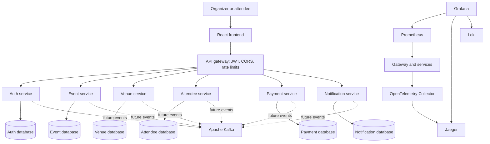

# System context

## Current scope

Phase 1 established the local-first platform foundation. Phase 2 implements only account authentication/authorization and the API-gateway security boundary. Event, venue, attendee, booking, payment, and notification business behavior remains deferred.

PostgreSQL databases are separate logical databases in one local container to keep local execution economical. This does not weaken ownership: credentials, migrations, tables, and queries remain service-specific. A cloud deployment may place those databases on separate instances without changing service contracts.

## Service responsibilities

| Service | Owns | Does not own |
| --- | --- | --- |
| `api-gateway` | Public routing, JWT validation, CORS, edge correlation, identity-header stripping, security headers, and Redis auth rate policies | Domain rules, account decisions, or persistent domain data |
| `auth-service` | Accounts, BCrypt credentials, JWT/JWKS, refresh sessions, RBAC, optional OAuth identities, and security audits | Attendees, events, or payments |
| `event-service` | Future event lifecycle, scheduling, categories, and capacity policy | Venue records or attendee registrations |
| `venue-service` | Future venue details, availability, and map-provider integration | Event schedules |
| `attendee-service` | Future attendee profiles, registrations, tickets, check-in, and booking process state | Payment transactions or event entities |
| `payment-service` | Future payment attempts, provider references, refunds, and payment ledger | Booking or attendee entities |
| `notification-service` | Future notification requests, templates, delivery attempts, and provider results | Source domain records from other services |
| `frontend` | Browser presentation and interaction | Business authority or secrets |

References to another service's concepts are scalar identifiers and immutable snapshots only. They never become cross-service JPA relationships.

## Communication rules

Use synchronous HTTP when the caller requires an immediate answer to continue a user interaction, or for a read owned by the target service. All public routes start with `/api/v1`; internal HTTP endpoints should also be explicitly versioned.

Use Kafka for integration events, long-running workflows, fan-out, and work that can complete after the initiating request. Kafka is the only message broker. Services must not use synchronous call chains to simulate distributed transactions.

Every network call has a timeout. Retries are allowed only for operations known to be idempotent and use bounded backoff with jitter. A circuit breaker may be introduced with the integration that needs it, rather than globally before behavior exists.

## Data ownership

- Each domain service has one PostgreSQL database and one database user locally. PostgreSQL `CONNECT` privileges are revoked from `PUBLIC` for service databases and granted only to the owning login.
- Only the owning service runs Flyway migrations against its database.
- A service never queries, maps, or writes another service's tables.
- Redis may later hold caches, rate-limit state, sessions, or short-lived coordination data, but never replaces an owning service's durable source of truth.
- Cross-service views are built through APIs, replicated event-fed projections, or purpose-built analytics stores.

## Reliable event publishing

Any future transaction that changes service-owned state and must publish a Kafka event will write both the domain change and an outbox row in the same local database transaction. A relay publishes the outbox record and marks it published. At-least-once delivery is assumed, so consumers must be idempotent. Publishing directly after a database commit is not considered reliable enough.

The outbox schema remains intentionally absent because there are no domain events yet. It will be added by the first service that publishes one, with a reusable operational pattern but service-owned migrations.

## Booking and payment Saga

The future booking/payment flow uses an orchestrated Saga. The attendee service owns booking process state and acts as the process manager; the payment service owns payment and refund state. Steps communicate through versioned Kafka messages, and each step persists its result before emitting the next event through its outbox.

Compensation is explicit. For example, a failed final booking step after payment authorization triggers a payment release or refund command. Compensation failure becomes a visible recoverable state for operations; it is not hidden by an infinite retry loop. No service opens a transaction against another service's database.

## Idempotency

- Public mutating commands will accept `Idempotency-Key` once those commands exist.
- The owning service scopes the key to caller and operation, stores a request fingerprint and terminal response, and rejects reuse with different input.
- Kafka messages carry a globally unique `eventId`. Each consumer records processed IDs within its own data boundary or performs an equivalent atomic business-state check.
- Retries must return the original outcome or safely converge on it. Exactly-once business semantics are achieved by application design, not assumed from transport settings.

## Provider adapters

Payment, email, SMS, maps, object storage, and AI integrations enter the owning service through an application port/interface. Provider SDKs, credentials, payloads, and error types remain in outbound adapter packages. Domain/application code depends on the port, while local tests use in-memory or deterministic fake adapters.

No object-storage flow exists in the current phase, so MinIO is not started. When an object use case is introduced, the first adapter will support a local S3-compatible provider and a cloud provider through the same port without making AWS credentials a local prerequisite.

Kubernetes, Helm, Terraform, and AWS topology are future deployment concerns and are not dependencies of local builds or tests.
